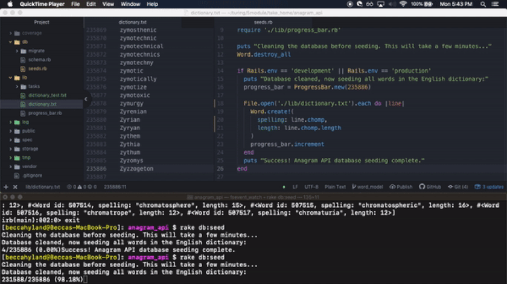

# Anagram API 
### Introduction
An anagram is a rearrangement of the letters of a word to form a new word. This API-only Rails app ingests the 235,886 word English dictionary and allows the user to search for anagrams, add new words to the dictionary individually or in batches, and delete one or all words from the dictionary.

The [production site](https://anagram-api-by-becca.herokuapp.com/) is seeded with some select anagrams, or for more anagram options, you can clone and download a copy of the app to seed and access the entire dictionary. (Production site hosted for free on Heroku, limited to 10000 database rows)

View this project's [Agile board](https://trello.com/b/jdQJCuqi/anagram-api) and scroll down for API endpoint info.

#### Seeding the app locally
Seeding the database with all words in the English dictionary. Handy progress indicator supports mental health!

### Design Overview
For performance, the following decisions were made:
1. When words are inserted into the database, the word length (in characters, an integer) is also stored in a column. When the API receives an anagram request, it looks for matches only in the subset of the dictionary where the length of the words matches the length of the requested subject.
* The trade-off of adding a database column for faster searches is that extra input formatting is needed before database insertion. See note below on Object-Oriented design.
2. The 'length' column on the Word table is indexed for speedy retrieval.

3. ActiveRecord's `pluck` is used here to save time by fetching less data (only the column requested)

For Object-Oriented design, the following decisions were made:
3. Formatting incoming POST Word requests for database compatibility (model logic) is handled by a PORO class `WordMaker` 
4. Mining the database and finding anagram matches is handled by a PORO class `AnagramSearch`

##### Edge Cases
* sad path for a request to DELETE a word that does not appear in the database (was erroring out with `nil`)
* sad path for a request to POST words with all invalid words (a valid word has 1-45 characters)

### Backlog for Iteration 2
1. See repo branch `cache_words_by_length` for a draft of a low-level caching solution. Draft caches in Rails `memory_store`, awaiting functional cache invalidation.
2. Guard against duplicate Word POSTs - currently any duplicates are filtered out of GET requests by the AnagramSearch class
3. API endpoint to DELETE one Word (in format requested by Product Owner) does not follow RESTful convention, making controller less readable when `params[:id]` is referenced and actually holds a word's spelling
4. Consider an endpoint to seed the database (rake task) with all Words in the dictionary.

### Local Setup
1. Clone this repository
2. On the command line: `bundle`, then...
3. `rake db:create` to create the database
4. `rake db:migrate` to setup the database
5. `rails server` to boot up a local version of the site you can make API requests to
6. Using the API endpoints below, add words to your database, then request anagrams or delete words (see endpoints)
optional: 7. For the most anagram fun, if you have time to seed the entire dictionary, run `rake db:seed`

### Running the test suite: video
1. After the above setup, run the developer's RSpec test suite with `rspec`
2. If you haven't done #7 above, you can also run the Product Owner's test suite with `ruby anagram_test.rb` (If you have already seeded the whole dictionary, one test that expects a more limited set of words will fail.)

##### Current Test Coverage:

### API Endpoints
##### POST `/api/v1/words.json`
* in the request body, using an HTTP client such as Postman (below) add one or more words in JSON format as follows: `{"words": ["absotively", "posilutely"] }`

##### DELETE `/api/v1/words/TYPE WORD TO DELETE HERE`
* deletes a specified word from the database

##### DELETE `/api/v1/words.json`
* deletes ALL words from the database (if you seeded the dictionary, this will take time)

##### GET `/api/v1/anagrams/TYPE ANY WORD HERE`
* returns a list of anagrams matching the submitted word
* try these words to see their anagrams: read, listen, Elvis, players

##### GET `/api/v1/anagrams/TYPE ANY WORD HERE THEN ADD ?limit=TYPE INTEGER HERE`
* returns a list of anagrams matching the submitted word, limited to the number provided

### Tech Stack
* Ruby 2.4.1
* Rails 5.2.2
* database: PostgreSQL
* testing: RSpec
* Continuous Integration: Travis CI
* hosting: Heroku
